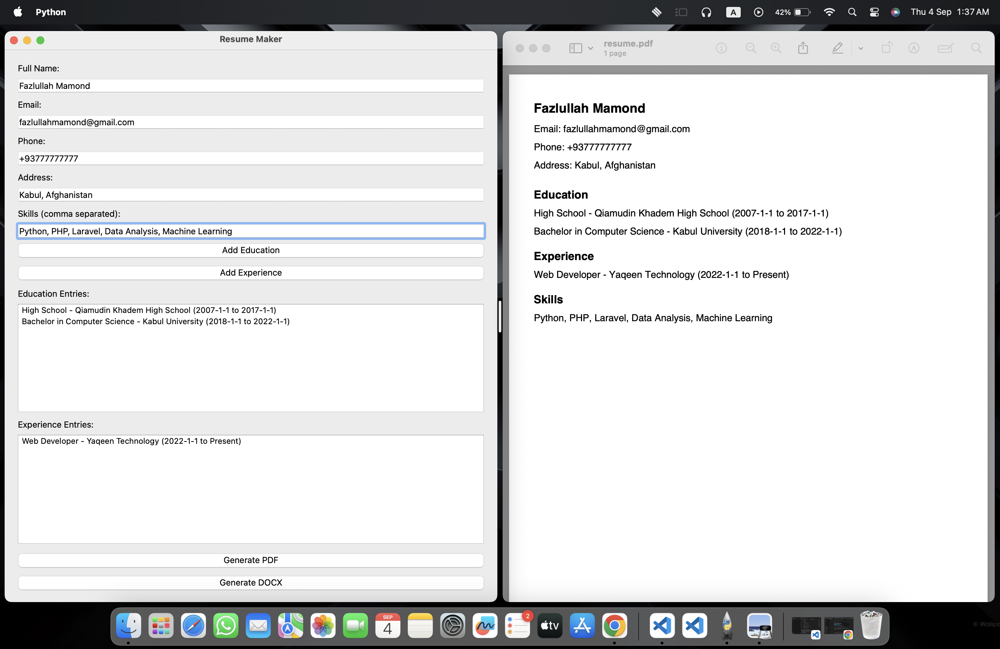

# Resume Maker Application



## Description
This is a Python-based Resume Maker application with a graphical user interface built using PyQt6. It enables users to create professional resumes in PDF or DOCX format by inputting personal information, education history, work experience, and skills. The application supports multiple education and experience entries and includes validation for emails, phone numbers, and dates.

## Features
- **GUI Interface**: User-friendly interface built with PyQt6 for easy data input.
- **Dynamic Entries**: Add multiple education and experience entries dynamically.
- **Input Validation**: Validates email, phone number, and date formats.
- **Resume Formats**: Generate resumes in PDF or DOCX format.
- **File Saving**: Save resumes to a user-selected location via a file dialog.
- **Entry Summary**: Displays a summary of added education and experience entries within the GUI.

## Requirements
- Python 3.8 or higher
- PyQt6
- fpdf
- python-docx
- re (standard library)
- datetime (standard library)

## Installation
1. Clone or download the project to your local machine:
   ```bash
   git clone <repository-url>
   ```
2. Install the required Python libraries:
   ```bash
   pip install PyQt6 fpdf python-docx
   ```
3. Run the application:
   ```bash
   python main.py
   ```

## Usage
1. Launch the application.
2. Enter personal information: name, email, phone, and address.
3. Input skills, separated by commas.
4. Add education history by clicking "Add Education" and filling out the prompts.
5. Add work experience by clicking "Add Experience" and filling out the prompts.
6. Review education and experience entries in the list boxes.
7. Choose to generate a PDF or DOCX resume.
8. Select the save location and filename when prompted.
9. The resume will be saved, and a success message will be displayed.

## Optional Enhancements
- Add support for including a profile picture.
- Implement multiple resume templates with different styles.
- Integrate with LinkedIn to automatically fetch profile information.
- Add auto-generated bullet points for skills and achievements.
